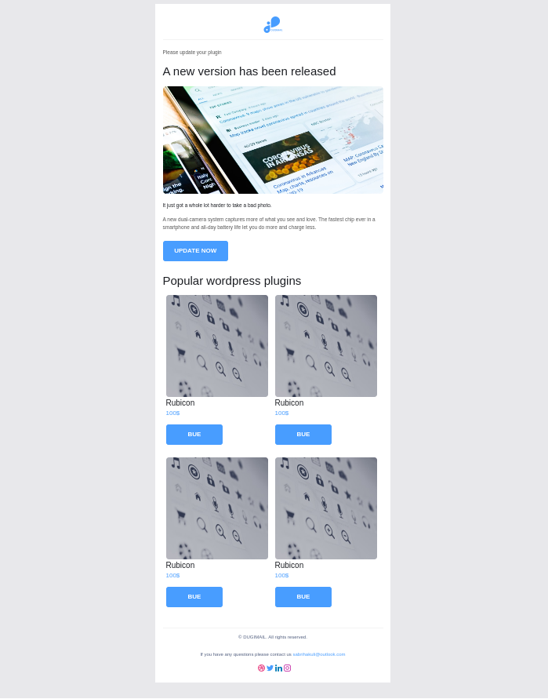
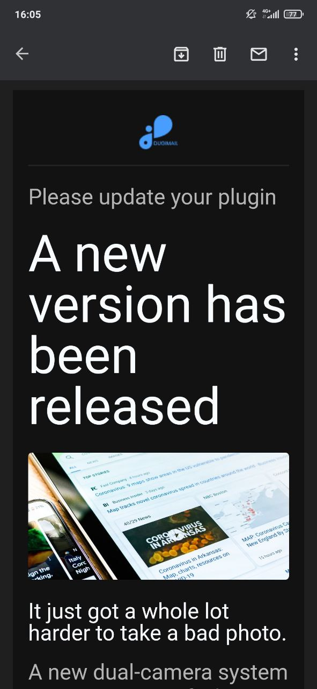
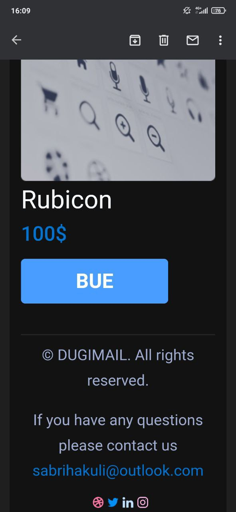

# Email шаблон

## Атрибуты
Для корректной работы писем указываем специальные атрибуты в тэгах -
DOCTYPE, html, table, a.

## Стили
Для корректной работы стилей используем инлайн подход

## Основные особенности
Используем табличную верстку div header footer не будут работатьм, шрифты загружаем с google fonts @import() и только те которые поддерживают письма, margin заменяем paddingОМ, отступы в тексте добавляем неразрывным пробелом `&nbsp;`, кнопкам задаем inline-block и делаем через а, src в картинках указываем ссылкой на https , не работают корректно свойства flex, grid, border-radius, media запросы

## Отображение письма в gmail
<h2>светлая тема</h2>

<h2>темная тема</h2>

